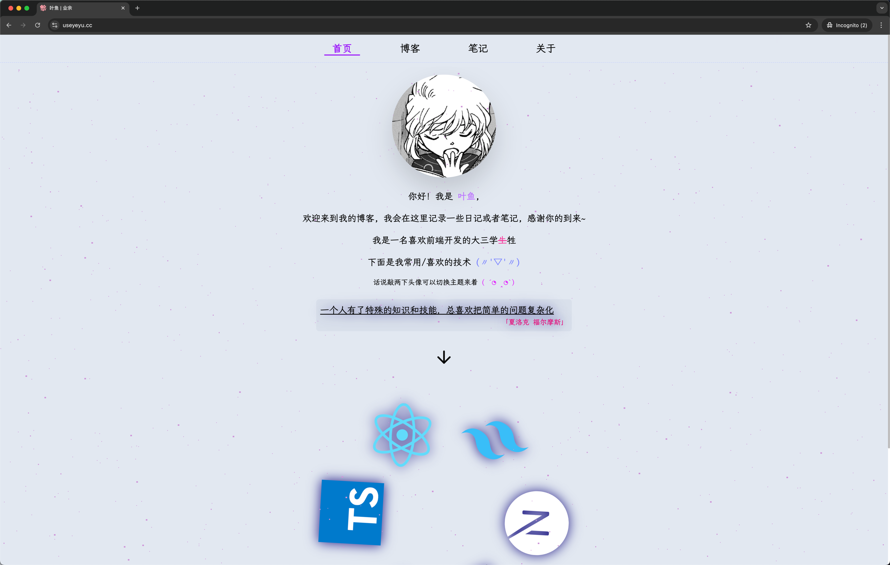
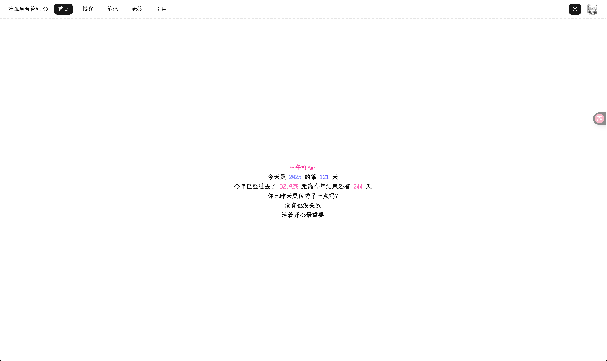

# yeyu-blog

个人开发的全栈博客项目，部署在 vercel 上，只有域名花了钱，感谢/感恩 vercel

博客地址 [叶鱼 | 业余](https://www.useyeyu.cc)

> 国内访问速度不确定，可能需要「出国留学」才能访问（逃），我在手机上测试过，好像访问速度还挺快的，还没有失败过，不确保以后~

## 主要技术栈

- Nextjs
- React
- TypeScript
- Tailwind CSS
- Shadcnui
- Motion
- Zustand
- Prisma

## 截图展示






## 本地运行

确保你已安装：

- Git
- Pnpm
- Node.js >= 20

### 获取项目代码

```shell
git clone https://github.com/NeilYeTAT/yeyu-blog.git
```

### 安装依赖

```shell
pnpm install
```
将项目根目录下的 `.env.example` 的 `example` 去掉:

现在你应该有一个 `.env` 文件，按照要求填写字段~

其实就两个，数据库的之后再填写：

```shell
SITE_URL=
NEXT_PUBLIC_ADMIN_EMAILS=
```

### 创建/白嫖数据库

> 为了测试方便，建议本地运行也直接使用白嫖的数据库，就没必要本地折腾数据库了~

- 注册 vercel 帐号 -> [vercel官网](https://vercel.com/)
- 点击导航按扭的 `Storage` 选项，创建数据库
- 选择 `Marketplace Database Providers` 下面的 `Neon` ~
  - 建议选择 Washington, D.C., USA (East) 地区

至此数据库已经白嫖成功了，接着我们来和数据库建立连接~

### 连接数据库

将 `Quickstart` 下的 `.env.local` 面板下的所有环境变量复制到 `.env` 文件中~

初始化表
```shell
npx prisma migrate dev --name init
```

启动！
```shell
pnpm install
pnpm dev
```

至此项目的前端展示是可以跑起来了，数据库也创建好了~

但控制台大概还在报错，问题不大，接下来会解决~

### admin 拦截

现在环境变量还有一些没有填写，控制台也在报错，如果此时直接访问 `http://localhost:3000/admin` 是可以直接访问的，没有任何拦截~

接下来就是配置 oauth 登录了。

运行生成 AUTH_SECRET:

```shell
npx auth secret
```

执行完后，多了一个 `.env.local` 文件，多了环境变量 `AUTH_SECRET`，现在再访问 `/admin` 页面，会直接重定向到登录页面~

### admin 登录/创建 oauth 应用

前往 [oauth app](https://github.com/settings/applications/new) 创建你的 oauth 应用。

表单填写：
Homepage URL: http://localhost:3000

Authorization callback URL: http://localhost:3000/api/auth/callback/github

获取 CLIENT_ID 和 CLIENT_SECRET，填写到 `.env.local` 文件中。

可以参考 [auth官网](https://authjs.dev/getting-started/authentication/oauth)

```env
AUTH_GITHUB_ID={CLIENT_ID}
AUTH_GITHUB_SECRET={CLIENT_SECRET}
```

就完成登录功能了~

### 修改网站信息

> 肥肠抱歉，由于本人技术太菜，所以很多地方都需要你手动去修改代码才能更新自己的配置，我会尽量告诉你各个文件的位置。

- config
  - constant 目录中包含项目的 metadata 和 首页动画文字展示，评论系统的仓库地址
  - img
    - 首页展示的个人头像，建议图片采用 webp 格式，再压缩一下~
    - [推荐图片处理工具](https://imagestool.com/)
  - svg
    - 存放底部的技术栈展示的 svg

- modules/main/page/main-home-page/internal/bio-section.tsx
  - 首页个人简介

- modules/main/page/about-page/index.tsx
  - /about 页面的简介

- components/shared/contact-me/index.tsx
  - 底部联系方式

### 安装评论系统

[评论系统官方文档](https://giscus.app/zh-CN)

首先按照上面官方文档的步骤来，去自己的 GitHub 创建一个仓库:

- 该仓库是公开的，否则访客将无法查看 discussion。
- giscus app 已安装，否则访客将无法评论和回应。
- Discussions 功能已在你的仓库中启用。

页面 ↔️ discussion 映射关系，选择 **Discussion 的标题包含特定字符串**，不需要填，只需要选择该选项就行了。

最后在 「启用 giscus」下有一个代码片段，**不要直接复制**，只需要复制 `data-repo` 和 `data-repo-id` 的值就可以了，其他配置项可以自行研究~

组件在 `components/shared/comment-card/index.tsx` 下，配置 `data-repo` 和 `data-repo-id` 的值在 `config/constant/index.ts` 中配置。

## 特别感谢🙏🏻

- [fuxiaochen](https://github.com/aifuxi/fuxiaochen)
